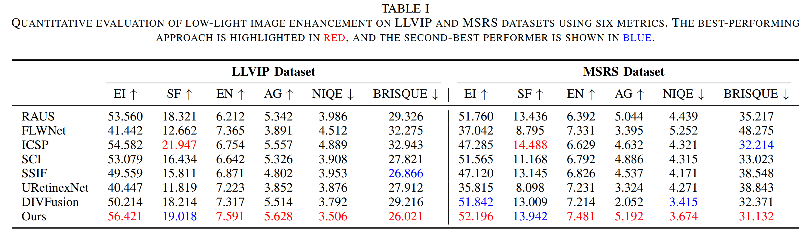

# Multimodal lowlight Image Enhancement

> [!NOTE]
> We will upload the codes and implementation instructions once our research paper has been accepted.

 

## Pipeline

## Results

**Figure 6 illustrates a comparison of the visual quality of our method with seven state-of-the-art techniques using three randomly chosen images from the LLVIP dataset.
**

**Figure 7 illustrates a comparison of the visual quality of our method with seven state-of-the-art techniques using three randomly chosen images from the MSRS dataset.**

**Table 1. Quantitative assessment of low-light image enhancement on LLVIP and MSRS datasets using six different metrics. The top-performing method is highlighted in red, while the second-best is indicated in blue.**

**Figure 8. Segmentation Outcomes Using Segment Anything**

**Figure 9. Object Recognition Outcomes Using YOLOv3**

## Implementation 
1. Create Environment
2. Requirements
3. Prepare Dataset
4. Testing
5. Training

## Contact
For support, email 20110720115@fudan.edu.cn

## Citation
If this work is helpful to you, please cite it as：

